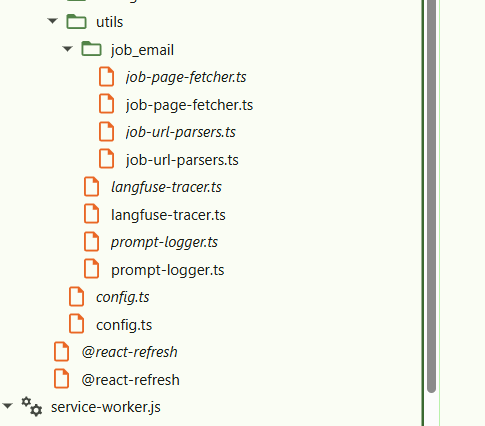
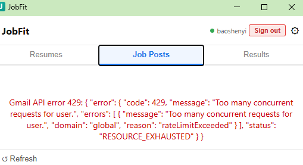

# Chrome Extension Debug Setup

## Debug

**DevTools is the recommended way.** VS Code F5 debugging is optional and complex (see Key Discovery section below).

### Popup code (e.g. `job-url-parsers.ts`, `match-analyzer.ts`, anything imported by `App.tsx`)

1. Open JobFit popup
2. Right-click anywhere in the popup → **Inspect**
3. In the DevTools window → **Sources** tab
4. Press **Ctrl+P** → type the filename (e.g. `job-url-parsers`) → select the **italic** entry
5. Click a line number to set a breakpoint

Replace step 4
you could drilling down from localhost


### Service worker code (e.g. `service-worker.ts`)

1. Go to `chrome://extensions`
2. Find JobFit → click **"Inspect service worker"** (opens a separate DevTools window)
3. **Sources** tab → **Ctrl+P** → type the filename → select the **italic** entry
4. Click a line number to set a breakpoint
5. Trigger the code (e.g. run an analysis from the popup) — execution will pause here

### Why each file appears twice in the Sources tree

- **Italic** = raw TypeScript served by Vite dev server (`localhost:5173`) — use this for breakpoints, line numbers match your source
- **Regular** = compiled JS bundled into the extension (`chrome-extension://...`) — line numbers won't match, avoid for breakpoints

Vite bundles your TS into `dist/` for the extension, but also serves the original `.ts` files over its local dev server so Chrome can resolve source maps. DevTools shows both.


## Key discovery (2026-04-10)

**Problem:** `vite-plugin-web-extension` was silently opening Chrome with a temp profile
(`C:\Users\baosh\AppData\Local\Temp\tmp-web-ext-*`) before VS Code could launch it.
This meant VS Code's `pwa-chrome` was attaching to the wrong Chrome instance — a fresh
anonymous profile with no Gmail sign-in and no real extension context.

**Fix:** Added `disableAutoLaunch: true` to `vite.config.ts` so the plugin only builds/watches
and never opens Chrome. VS Code's F5 is now the only thing that launches Chrome.

**Remaining issue (unresolved):** Chrome 127+ blocks `--remote-debugging-port=9222` when
using a real user profile. Attach mode (port 9222) does not work. Launch mode with
`pwa-chrome` opens Chrome with Profile 2 and Gmail signed in, but VS Code shows
"Unable to attach to browser." Next session: investigate why `pwa-chrome` debug pipe
fails with real profile, OR revert to `.vscode/chrome` custom profile + handle Gmail
auth through the extension's own `chrome.identity` OAuth popup (does not need Gmail
web session).

## Daily workflow

### 1. Close Chrome completely
```powershell
Get-Process chrome | Stop-Process -Force
```

### 2. Build the extension
```powershell
cd D:\JobFit; npm run dev
```

## Solve issue later

