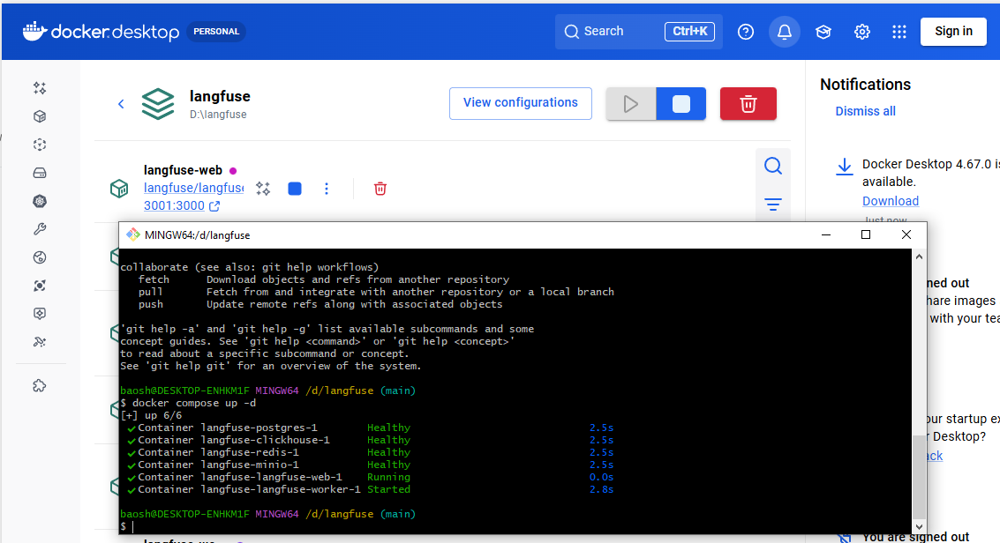

# JobFit

Chrome extension that matches resumes against job postings using a local LLM.

## Tech Stack

| Layer | Technology |
|-------|------------|
| **Extension** | Chrome Extension (Manifest V3), Chrome Storage API |
| **UI** | React 18, TypeScript |
| **Build** | Vite, vite-plugin-web-extension |
| **Testing** | Vitest |
| **Email** | Gmail API (OAuth2) |
| **LLM** | Ollama (local), Anthropic Claude API, OpenAI-compatible API |
| **Observability** | Langfuse (self-hosted via Docker) |

## Local Langfuse (observability)

See **Setup.md → Langfuse Setup** for full installation steps.



Prompt logs (resume + job + generated prompt + LLM response) are sent to Langfuse when enabled. Auto-download to disk is suppressed to avoid notification spam; use the "📁 Log and Download folder" button in the Results tab to open the downloads folder.

- Run test.ts => npx vitest run --reporter=verbose

## Fix log

| # | Fix | Files |
|---|-----|-------|
| 1 | Done jobs showed no date — both `✓ Done` badge and date now render together | `JobPostsTab.tsx` |
| 2 | `JobEmail.date` as `Date` caused "Invalid Date" after Chrome storage round-trip — changed to Unix ms `number` | `types.ts`, `gmail-client.ts`, `JobPostsTab.tsx`, `match-analyzer.ts` |
| 3 | Results appeared all-at-once instead of one-by-one — `setResultsData` restored inside innermost loop | `App.tsx` |
| 4 | Progress banner showed `0/1` instead of `1/6` — tracks URL count, increments inside URL loop | `App.tsx` |
| 5 | "Analyze Selected" → Results tab jump kept breaking — added comment explaining standalone window flow | `App.tsx` |
| 6 | Standalone window overlapped Chrome download panel — opens on right edge of screen; size/margin in config | `App.tsx`, `config.ts` |
| 7 | Per-pair `chrome.downloads.download()` spammed notification bubbles over Results UI — `savePromptLog` suppressed (no-op) | `prompt-logger.ts`, `App.tsx` |
| 8 | "📁 Log and Download folder" button added to Results tab toolbar | `ResultsTab.tsx` |
| 9 | Download report grouped by `jobEmailId` so only first job URL appeared — fixed to group by `jobUrl \|\| jobEmailId` | `ResultsTab.tsx` |
| 10 | Langfuse tracer missing `type: 'trace-create'` in ingestion batch body | `langfuse-tracer.ts` |
| 11 | Prompt logs note in README was stale (logs are now suppressed, not auto-downloaded) | `README.md` |
| 12 | No first-run guidance — added `settingsAcknowledged` flag; ⚙ button pulses and `👉 Start here` appears inline in header until user opens Settings once | `config-store.ts`, `App.tsx` |

## AI Agent (future)

> Notes from [AI Agents video course](https://www.youtube.com/watch?v=ftBWgcwvEk4)

### 1. The 3 Core Building Blocks (The Ingredients) `4:38 - 10:34`

| Building block | Examples | Use cases |
|---|---|---|
| **Models** | LLMs | Text generation, tool use, information extraction |
| | Other AI models | PDF-to-text, text-to-speech, image analysis |
| **Tools** `5:07` | API | Web search, get real-time data, send email, check calendar |
| | Information retrieval | Databases, Retrieval Augmented Generation (RAG) |
| | Code execution | Basic calculator, data analysis |
| **Evaluations** `8:30` | Evals | Quality control — measure performance objectively; you cannot improve without these |

### 2. The 4 Agentic Design Patterns (The Architecture) `11:31 - 28:51`

| Pattern | Concept | JobFit Example |
|---|---|---|
| **Reflection** `12:23` | Agent reviews and iteratively improves its own output | qwen3:8b drafts a match analysis → re-reads it → rewrites weak sections before returning |
| **Tool Use** `13:35` | Agent autonomously selects and triggers tools beyond its training data | Agent fetches live job posting from URL, reads resume from Gmail label, then analyzes both |
| **Planning** `24:28` | Agent decomposes a complex goal into a multi-step execution map | Goal: "Is this job worth applying?" → steps: extract skills from job → extract skills from resume → gap analysis → score → suggest edits |
| **Multi-Agent** `26:54` | Orchestrate multiple specialized agents in tandem | **Extractor agent** parses resume + job → **Matcher agent** scores fit → **Coach agent** writes tailored cover letter bullets |

### 3. Evaluating JobFit Match Quality

Two approaches — use both together:

| Method | How | When to use |
|---|---|---|
| **Code eval** (objective) | `if len(analysis) >= 50` / `if "score" in analysis` | Fast sanity checks — is output non-empty, does it contain expected fields? |
| **LLM-as-judge** (subjective) | Send resume + job + qwen3:8b output to ChatGPT with a rubric | Grading quality — did it catch the right skill gaps? Is the score justified? |

**Benchmark workflow** — run 5–10 pairs through both models and compare:

```
Prompt to ChatGPT (judge):
  "Here is a resume, a job posting, and a match analysis generated by a local LLM.
   Grade the analysis on:
   (i)   Did it identify the top skill gaps?
   (ii)  Is the match score justified by evidence?
   (iii) Did it miss anything important?
   Score each criterion 1–5 and explain."
```

> This is free testing for your local model — if qwen3:8b consistently misses what GPT-4o catches, you know exactly where to improve your prompt in `src/config.ts`.

### 4. Planning Pattern — Risks & Quality Control

The Planning pattern (chaining multiple LLM calls where each step feeds the next) is powerful but unstable.

**Risks:**

| Risk | Why it happens | Impact |
|---|---|---|
| **Error compounding** | Step 2 feeds on Step 1 output — a bad Step 1 poisons everything downstream | Final result is wrong but looks confident |
| **Hallucinated tool calls** | LLM invents function names or parameters that don't exist | Runtime crash or silent wrong data |
| **Infinite loops** | LLM re-plans endlessly, never decides it's done | Cost blowout, timeout |
| **Latency** | 3+ LLM calls in sequence = 3× the wait time | Poor UX |
| **Cost** | Each step is a full API call | Expensive at scale |
| **Prompt drift** | Each step's context grows longer → model loses focus | Later steps ignore earlier instructions |

**Quality Control:**

| Control | How |
|---|---|
| **Validate each step** | Schema/content check before passing output forward — fail fast, don't compound |
| **Cap steps** | Hard limit (e.g. `MAX_STEPS = 5`) — never let the agent plan beyond this |
| **Reflection step** | After each tool call ask: "Does this output look correct? Y/N" |
| **Human-in-the-loop** | Pause at key decision points, show intermediate results before continuing |
| **LLM-as-judge at end** | Send final output to GPT-4o to verify quality (see Section 3 above) |

**JobFit-specific risk:** Current flow is one LLM call per resume+job pair — stable and cheap. If evolved to Planning pattern (fetch URL → extract requirements → score → suggest edits), the biggest risk is Step 1 (URL fetch/parse) failing silently — Steps 2–3 would then analyze garbage HTML instead of the actual job description. Guard that boundary first.

### 5. Local LLM Deployment

> From [Local LLM video](https://www.youtube.com/watch?v=vehYE1DfkZg) — *Your machine. Your data. Your rules.*

| | Details |
|---|---|
| **Tools** | Ollama, LM Studio, llama.cpp, vLLM, Open WebUI, Docker + Ollama, Cloudflare Tunnel |
| **Best for** | Privacy-sensitive work, offline use, personal AI assistant, always-on server (e.g. Mac Mini) |

**Examples:**
- Replace ChatGPT privately → LM Studio + open source model, nothing leaves your machine
- Mac Mini home server → always on, access from any device at home, zero monthly cost
- Local app with public demo → Ollama + Cloudflare Tunnel to share with teammates

| Pros | Cons |
|---|---|
| Completely private — data never leaves your machine | Limited by your hardware |
| Free to run after hardware cost | Need to keep machine running |
| Works fully offline, no rate limits | You manage everything yourself |


