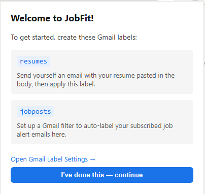

# JobFit Setup Checklist

## Google Cloud Console (project: JobFit)
- https://console.cloud.google.com/ → sign in → select JobFit project

- [ ] Gmail API enabled
  - Left menu: **APIs & Services → Enabled APIs** → search `Gmail API` → Enable
- [ ] OAuth client created
  - Left menu: **Google Auth Platform → Clients** → Create Client → Chrome Extension
  - Item ID = Chrome extension ID from `chrome://extensions`
- [ ] Scope added
  - Left menu: **Google Auth Platform → Data access** → Add or remove scopes
  - Manually add: `https://www.googleapis.com/auth/gmail.readonly` → Update → Save
- [ ] Test user added
  - Left menu: **Google Auth Platform → Audience** → Test users → + Add users → your Gmail

## manifest.json
- [ ] `client_id` = OAuth client ID from Google Cloud Console

## Gmail (your account)
- [ ] Label `resumes` exists — send yourself an email with resume in body, apply label
- [ ] Label `jobposts` exists — apply to job alert emails

## Build & Load or Reload ↺
```bash
npm install
npm run build
```
Chrome → `chrome://extensions` → Developer mode ON → Load unpacked → select `dist/`

## Should see it after sign in
