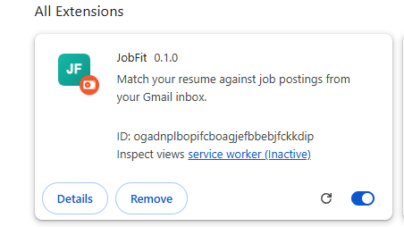
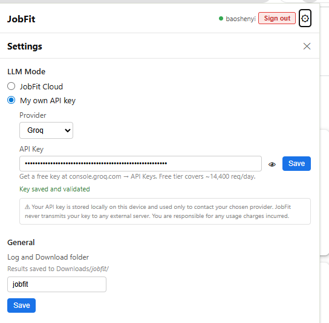
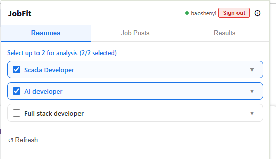
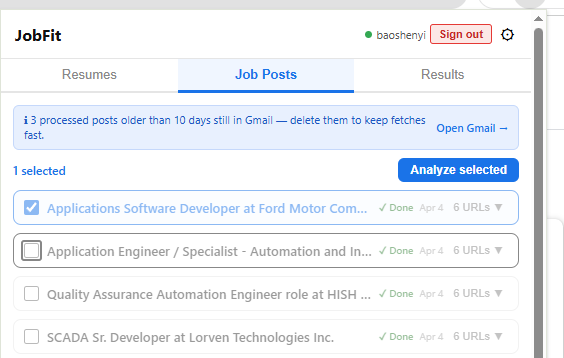
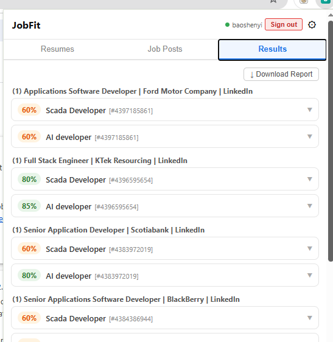
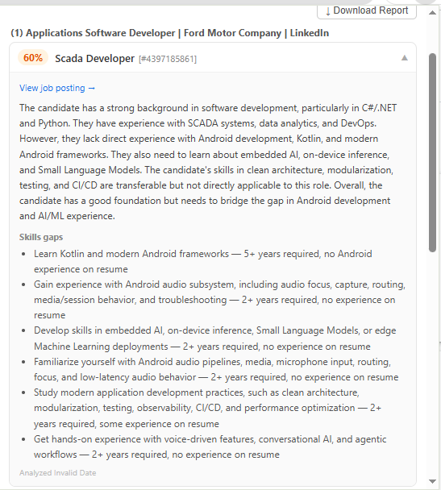
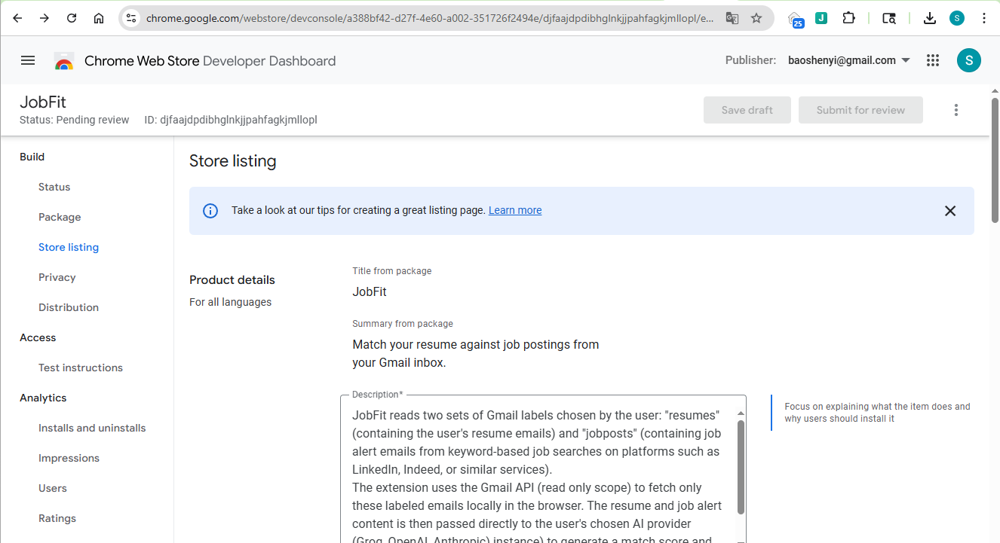

# Chrome Web Store Submission Guide — JobFit

## Prerequisites

- [ ] Google developer account — one-time $5 fee at [chrome.google.com/webstore/devconsole](https://chrome.google.com/webstore/devconsole)
- [ ] Extension built: `npm run build` → produces `dist/` folder
- [ ] Privacy policy hosted publicly (e.g. GitHub Pages)

---

## Step 1 — Host the Privacy Policy

Push `docs/privacy-policy.html` to a public URL, e.g.:
- https://patient-smoke-b315.baoshenyi.workers.dev/privacy-policy
---

## Step 2 — Prepare Assets

| Asset | Size | Notes |
|-------|------|-------|
| Icon 16×16 | PNG | For browser toolbar |
| Icon 48×48 | PNG | For extensions page |
| Icon 128×128 | PNG | Required for store listing |
| Screenshot 1–5 | 1280×800 or 640×400 PNG/JPG | Show key UI screens |
| Promotional tile | 440×280 PNG | Optional but recommended |
- Vite strips the public/ prefix when copying — so public/icons/icon16.png → dist/icons/icon16.png

**Suggested screenshots to capture:**
1. Job Posts tab — showing job emails list
2. Results tab — showing match scores for multiple jobs
3. Settings panel — showing API key setup
4. Results expanded — showing match summary and skills gaps






---

## Step 3 — Zip the Extension

```bash
cd dist
zip -r ../jobfit-v0.1.0.zip .
D:\JobFit
D:\JobFit\dist\jobfit-v0.1.0.zip
```

Or on Windows PowerShell:
```powershell
Compress-Archive -Path dist\* -DestinationPath jobfit-v0.1.0.zip
```

---

## Step 4 — Create the Store Listing

Go to [Chrome Web Store Developer Dashboard](https://chrome.google.com/webstore/devconsole) → **New Item** → upload the `.zip`.

### Store Listing Fields

**Name:** JobFit

**Short description (max 132 chars):**
> Match your resume against job postings from your Gmail inbox using AI. Get instant fit scores and skills gap analysis.

**Full description:**
```
JobFit automatically reads job emails from your Gmail inbox and matches them against your resume using AI — giving you a match score, summary, and skills gap list for each posting.

How it works:
1. Label your resumes as "resumes" and job alert emails as "jobposts" in Gmail
2. Open JobFit and select the jobs you want to analyze
3. Get instant AI-powered match scores with actionable feedback

Supports multiple AI providers: Groq (free), OpenAI, Anthropic, or a local Ollama model.

Your data stays private — resume and job text is sent only to the AI provider you choose, never to our servers.
```

**Category:** Productivity

**Language:** English

**Privacy policy URL:** your hosted privacy-policy.html URL

---

## Step 5 — Permissions Justification

Google will ask you to justify each sensitive permission. Use these:

| Permission | Justification |
|-----------|---------------|
| `identity` + `gmail.readonly` | Authenticate with Gmail and read emails labeled "resumes" and "jobposts" to perform resume-job matching |
| `storage` | Store user settings and analysis results locally in the browser |
| `tabs` + `scripting` | Open job posting URLs from emails in background tabs to extract full job descriptions for analysis |
| `downloads` | Save analysis reports as files to the user's Downloads folder |
| `https://*/*` (host permission) | Job posting pages can be on any domain — LinkedIn, Indeed, company career pages, etc. The extension must fetch these pages to extract job descriptions |
| `windows` | Open a persistent analysis window that stays open while analyzing multiple jobs |

---

## Step 6 — OAuth / Gmail API Justification

Because JobFit uses `gmail.readonly` scope, Google requires a **Sensitive Scope Review**. You will need to:

1. Submit a **YouTube video** (unlisted) demonstrating: https://youtu.be/pPRQJCrydH4
   - How the extension requests the Gmail permission
   - What it does with Gmail data (reads labeled emails only)
   - That no data is transmitted to your servers
2. Provide a **written explanation** of why `gmail.readonly` is needed

**Sample explanation:**
> JobFit reads two sets of Gmail labels chosen by the user: "resumes" (containing the user's resume emails) and "jobposts" (containing job alert emails from keyword-based job searches on platforms such as LinkedIn, Indeed, or similar services).
>
> The extension uses the Gmail API (read only scope) to fetch only these labeled emails locally in the browser. The resume and job alert content is then passed directly to the user's chosen AI provider (Groq, OpenAI, Anthropic) to generate a match score and skills gap analysis for each job to help users quickly identify the best-fit roles to apply for and the skills worth developing.
>
> Groq API:
> - Sign up / API key: console.groq.com
> - API base URL: https://api.groq.com/openai/v1
> - Free tier: yes, no credit card required

---

## Step 7 — Email Collection Disclosure

In the **Privacy practices** section of the store listing, declare:

- **Personal data collected:** Email address
- **Purpose:** Product updates and early access announcements
- **Data handling:** Stored securely on Cloudflare infrastructure, not shared with third parties, not used for advertising

---

## Step 8 — Submit for Review

- First submission typically takes **3–7 business days**
- Due to broad host permissions (`https://*/*`), Google may flag for in-depth review — allow **up to 2 weeks**
- You will receive an email when approved or if changes are requested
- Extension ID: `djfaajdpdibhglnkjjpahfagkjmllopl`
- If rejected, Google will provide a reason — common issues:
  - Missing permission justification
  - Privacy policy doesn't cover all data collected
  - Screenshots don't match the extension's actual UI

### Submitted — Pending Review (April 9, 2026)



---

## Useful Links

- [Chrome Web Store Developer Dashboard](https://chrome.google.com/webstore/devconsole)
- [Chrome Extension Review Policy](https://developer.chrome.com/docs/webstore/review-process/)
- [Sensitive Permissions Guide](https://developer.chrome.com/docs/webstore/permissionwarnings/)
- [Gmail API OAuth Verification](https://support.google.com/cloud/answer/9110914)

---

## Check Signup Emails (Cloudflare KV)

When users sign in to JobFit, their Gmail address is stored in Cloudflare KV under the **SIGNUPS** namespace.

**To view signups:**
1. Go to [Cloudflare Dashboard](https://dash.cloudflare.com) → **Storage & databases → Workers KV**
2. Click the **SIGNUPS** namespace
3. Click **KV Pairs** tab
4. Browse or search entries — each key is `{timestamp}:{email}`, value is the email address

**Example entries:**
```
Key                                    Value
1775693296671:test3@example.com        test3@example.com
1775705165150:baoshenyi@gmail.com      baoshenyi@gmail.com
```
