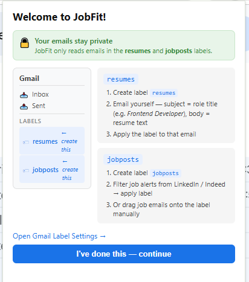
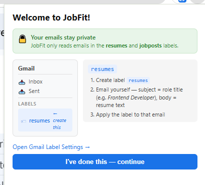
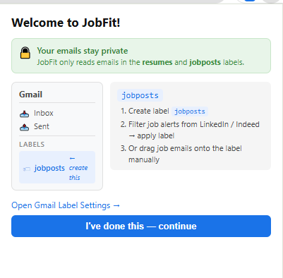

# Completed

## Tested (Stages 1–2)

### 1. Chrome Extension Scaffold
- `manifest.json` — Manifest V3, OAuth2, permissions (`identity`, `storage`, `downloads`)
- Vite + React 18 + TypeScript build runs cleanly (`npm run build`)
- Extension loads in Chrome via DevTools > Load Unpacked

### 2. Google OAuth
- `src/gmail/gmail-auth.ts` — `chrome.identity.getAuthToken()` flow works
- User can authorize the extension with their Google account
- Token passed correctly to Gmail REST API calls

### 3. Gmail Label Check
- `src/gmail/gmail-client.ts` — `labelExists()` queries Gmail API and returns true/false
- `src/popup/components/App.tsx` — routes to OnboardingScreen when `resumes` or `jobposts` labels are missing; routes to main UI when both exist
- 10-second timeout on label check with error fallback works

### 4. Onboarding Screen — 3-step flow tested
- Visual Gmail sidebar mockup renders with highlighted missing labels
- **resumes label instructions** (3 steps) display correctly:
  1. Create label `resumes`
  2. Email yourself — subject = role title, body = resume text
  3. Apply the label to that email
- **jobposts label instructions** (3 steps) display correctly:
  1. Create label `jobposts`
  2. Filter job alerts from LinkedIn / Indeed — apply label
  3. Or drag job emails onto the label manually
- "Open Gmail Label Settings →" opens `https://mail.google.com/mail/#settings/labels`
- "I've done this — continue" re-checks labels and advances once both labels exist
- Privacy notice ("Your emails stay private") renders with correct copy

#### Tested

### 5. Settings Panel
- `src/popup/components/SettingsPanel.tsx`
- LLM mode radio buttons: JobFit Cloud / My Own API Key / Ollama
- BYOK provider dropdown (Groq / Anthropic / OpenAI) with per-provider hints
- API key input with show/hide toggle; key validation calls correct endpoints
- BYOK one-time waiver modal + fine-print acknowledgment box
- Download folder input field (default: `jobfit`)
- All state saves to `chrome.storage.sync`

### 6. Config Storage
- `src/storage/config-store.ts` — reads/writes `AppConfig` to `chrome.storage.sync`
- LLM mode, API key, provider, save folder all persist across popup open/close

---

## Scaffold Only (No Logic Yet — Stage 3+)

| File | Notes |
|------|-------|
| `src/popup/components/ResumesTab.tsx` | Placeholder — will list resumes from `resumes` label |
| `src/popup/components/JobPostsTab.tsx` | Placeholder — will list job URLs from `jobposts` label |
| `src/popup/components/ResultsTab.tsx` | Placeholder — will show match scores + download button |

---

## Not Yet Started

- `src/llm/` — LLM provider abstraction (Groq, Anthropic, OpenAI, Ollama, JobFit Cloud)
- `src/analyzer/` — resume reader, job post reader, match analyzer
- `src/utils/` — URL extractor, job crawler, MIME decoder
- `src/storage/result-store.ts` — results cache via `chrome.storage.local`
- Cloudflare Worker — JobFit Cloud subscription token validation
